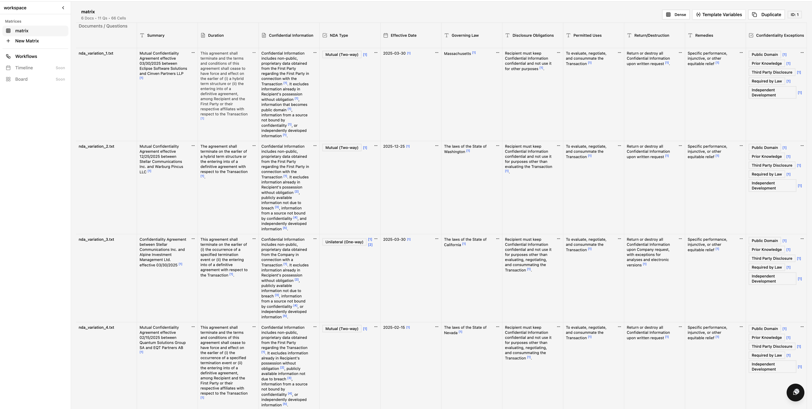

# Corpus

Document Q&A powered by AI. Upload documents, ask questions, get answers with citations.

<a href="https://onecorpus.com"></a>

## Demo




*For higher quality demos, see [assets/demo-large.gif](assets/demo-large.gif).*

### Video Walkthroughs

See [demos](demos) for video tutorials:
- **Getting Started** - Upload documents and ask questions
- **Cross-Correlation** - Compare answers across documents
- **Workflow Creation** - Create automated workflows
- **Workflow Output** - View and export results

## What it does

- Upload PDFs and web pages
- Ask questions in natural language
- Get answers with citations linking back to source text
- Organize documents into workspaces and document sets

## Local Development

### Prerequisites

- Docker & Docker Compose
- Python 3.11+ (for running outside Docker)
- Node.js 20+ (for running outside Docker)

### Quick Start

```bash
git clone https://github.com/noetic-sys/corpus.git
cd corpus

# Copy environment files
cp backend/.env.example backend/.env
cp vite/.env.example vite/.env.development

# Start everything
docker-compose up
```

This starts the full stack:
- Frontend at http://localhost:3001
- API at http://localhost:8000
- API docs at http://localhost:8000/docs
- Temporal UI at http://localhost:8080
- RabbitMQ management at http://localhost:15672

### Running without Docker

If you prefer to run services individually:

```bash
# Start just the infrastructure
docker-compose up postgres postgres_temporal rabbitmq corpus-redis elasticsearch localstack temporal temporal-ui

# Run backend
cd backend
poetry install
poetry run alembic upgrade head
poetry run uvicorn api.main:app --reload

# Run frontend
cd vite
npm install
npm run dev
```

## Architecture

| Component | Purpose |
|-----------|---------|
| FastAPI | API server |
| React + Vite | Frontend |
| PostgreSQL | Primary database |
| Elasticsearch | Full-text search |
| RabbitMQ | Message queue |
| Temporal | Workflow orchestration |
| Redis | Cache |
| S3 (LocalStack locally) | Document storage |

## Supported Models

**LLM Providers**
- OpenAI (GPT-4o, GPT-4, etc.)
- Anthropic (Claude 4, Claude 3.5, etc.)
- Google (Gemini)
- xAI (Grok)

**Embedding Providers**
- OpenAI
- Voyage AI

## Contributing

See [CONTRIBUTING.md](CONTRIBUTING.md).

## License

AGPL-3.0 - see [LICENSE](LICENSE).

Copyright (C) 2025 Noetic Systems, LLC
